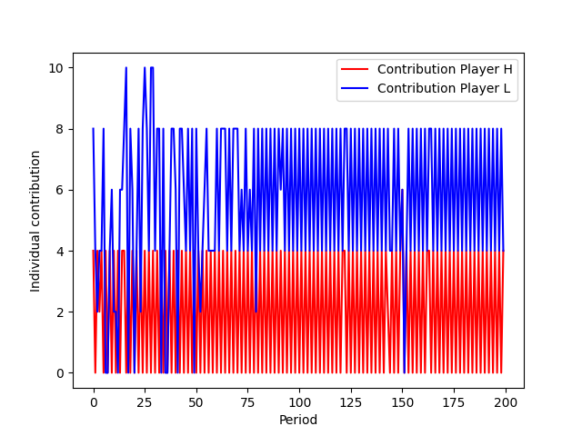
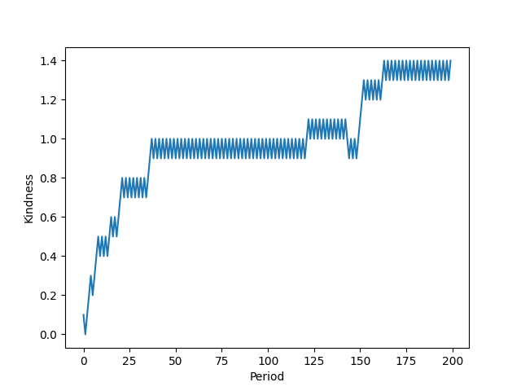
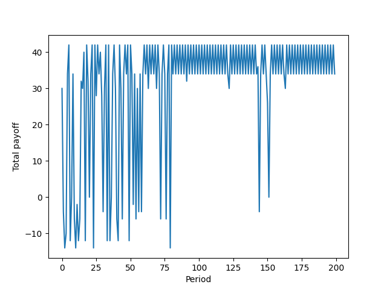

# Reciprocity AI
This project allows an artificial decision maker to reciprocate user behavior with kind or unkind actions. Although only a proof of concept, the project shows that an AI can be given human-like traits by modifying its objective function. Moreover, a neural network can condition its behavior on manifestations of these traits. Specifically, an AI can learn to recognize if it interacts with a kind person. And it can learn to treat a person in a way that is reciprocated by kind behavior, even if the AI does not experience similar sentiments.

The capability to reciprocate user behavior is useful in all kinds of situations, such as in negotiations about the allocation of resources for the purpose of reaching a common goal.

## Theoretical Background
The algorithm behind the allocation game (see below) assumes an objective function ("utility") that reflects other-regarding preferences according to the reciprocity model by Charness & Rabin (2002). Let $m$ and $o$ respectively denote the payoffs of the decision maker ("mine") and the user ("other"). The decision maker's objective function $U_m$ can then be defined piecewise by
$$U_m = a\cdot m + r\cdot (1-a)\cdot o$$   
if   
$$m \ge o$$
and
$$U_m = b\cdot m + r\cdot (1-b)\cdot o$$   
if   
$$m < o$$
where $a$, $b$, and $r$ are real numbers.

Kerschbamer (2015) distinguishes nine preference types depending on the choice of parameters $a$ and $b$ (letting $r = 1$). The additional kindness parameter $r$ changes the decision maker's preferences in reaction to kind or unkind actions of the user. Specifically, $r$ increases (decreases) if $m > (<) o$.

If $a=b=1$, the decision maker is "selfish" so that $U_m=m$, independent of the user's payoff $o$ and kindness $r$. 

## Teaching the AI to be kind
### The allocation game
The file `allocation_game.py` describes a simple reinforcement learning algorithm based on Q learning that adapts to opponent behavior in a burden-sharing task. The task is to jointly allocate a workload in hours between the decision maker (the AI) and the user. Each agent, decision maker and user, can work from 0, 2, 4, 6, 8 to 10 whole hours each period. Working is costly, though, with 1 hour costing the decision maker $1 and the user $3; the decision maker is more efficient. If the total sum of working hours in a given period equals or exceeds 8 hours, each agent receives a completion bonus of $25 (minus the cost of working).

There are any number of ways in which the target workload of 8 hours per period can be divided among the two agents. This is therefore a coordination problem. To complicate matters, different social norms can motivate different allocations, e.g. equal contributions (4,4) or equal cost of working (6,2).

The standard setup has a human agent (in the role of user) performing this task repeatedly with the decision maker until a stable agreement is reached. The decision maker uses Q learning to

* reach an allocation whose sum equals 8 hours (coordination) and
* adapt kindness $r$ in reaction to earned payoffs.

Kindness $r$ influences the decision maker's other-regarding preferences $U_m$ and thus the utility of each allocation of the workload. In particular, the Q values of the learning algorithm are updated by using utility as reward. Default starting parameters set $0 < a , b < 1$ (exact values determined randomly) and $r=0$. Kindness $r$ is updated incrementally by adding or subtracting a sensitivity parameter (set equal to 0.1); there is no upper or lower bound.

### A neural network trained to play the game
The file `deepRL_vs_ag.py` contains the code for a deep reinforcement learning algorithm that takes the role of user, just like the human agent. The algorithm's neural network receives as inputs last round's contributions of both players (user and decision maker) and the decision maker's current kindness value. These inputs are then converted into a mixed strategy that assigns a probability to each of the six possible contribution choices to determine the user's action.

A checkpoint is included that provides the neural network's weights after 10,000 epochs of training. Evaluating this checkpoint shows that the neural network alternates between working 0 and 4 hours, which the decision maker reciprocates by alternating between 8 and 4 hours.

Kindness increases quickly and then remains more or less stable (discounting the regular fluctuations).

As a result total payoffs in later periods are significantly higher than at the beginning of the game when the decision maker still needs to learn the payoffs.

### Large language models as negotiators
Maybe more complicated architectures can be expected to perform even better. Here is what AnonChatGPT suggests:

Question: 

*My colleague is much more productive than me. How can I convince him to do some of my work, too?*

Answer (AnonChatGPT):

*It's important to approach this situation carefully and respectfully. Rather than asking your colleague to do your work, consider discussing the workload and responsibilities with them to see if there are any tasks that could be shared or divided more evenly.
You could also highlight the benefits of collaboration and how sharing work can lead to better outcomes for both of you. Additionally, offering to take on some of your colleague's tasks in return could make them more willing to help you with yours.
Open communication and a willingness to compromise are key in approaching this situation. Ultimately, it's important to be mindful of your colleague's workload and boundaries, and to work together to find a solution that benefits both of you.*

## User manual for the GUI
The allocation game can be started by running `main.py` in a Python console.

To choose your ("Player H") working hours, select the corresponding number in the field "Hours H", then click the "Calculate" button. This will generate the decision maker's ("Player L") workload for that period. Also displayed are the resulting payoffs.

The game ends automatically after 200 periods or if the same allocation of hours occurs in five consecutive rounds, whether or not the goal of 8 total hours is reached. This triggers an exit window with several game statistics. Click the button to end the program.

At any other time, you can access the "File" menu to restart the game via the "Reset" option or to "Exit" the game manually. Alternatively, the "History" menu can be used to generate plots of results from previous periods such as "Total payoffs" or "Individual contributions". The "Reward" and "Kindness" plots may offer helpful information about the decision maker's learning progress.

## How to contribute
Although this project is not currently open to contributions, there are several ways in which it could be adapted or expanded:
* Most real-life negotiations are much more complex than the burden-sharing problem described here. It might therefore be interesting to add more features to the game, such as "cheap talk" between user and decision maker. (ChatGPT would clearly appreciate such a feature.)
* The current graphics are rather plain. Add some colors. Maybe replace the kindness function with a suitable range of emojis (e.g. from angry to happy).
* Learning is more difficult if there are more actors or more possible actions, maybe too difficult for Q learning. Replace the decision maker's Q learning algorithm with a neural network. The tricky part is probably to define a suitable objective function that includes a (separately updated) kindness parameter.
* Use additional user data to determine if behavior is kind or unkind. Do they use insulting language or make compliments (sentiment analysis)? Are they honest or dishonest (pattern recognition applied to physical cues)?

## References
* G. Charness & M. Rabin (2002): Understanding social preferences with simple tests, Quarterly Journal of Economics, Vol. 117, No. 3, pp. 817-869.
* R. Kerschbamer (2015): The geometry of distributional preferences and a non-parametric identification approach: The Equality Equivalence Test, European Economic Review, Vol. 76, pp. 85-103.
* Deep reinforcement learning on Hugging Face: https://huggingface.co/learn/deep-rl-course/unit4/hands-on
* An anonymous version of ChatGPT: https://anonchatgpt.com/

## List of files
* `main.py`: GUI to play the allocation game
* `allocation_game.py`: Environment representing the allocation game
* `deepRL_vs_ag.py`: Code to train and evaluate a neural network in playing the allocation game (checkpoint file: `checkpoints/deepRL_vs_ag_10000.pt`)
* `appmenu.py`: Auxiliary file (menu bar for GUI)
* `project_functions.py`: Auxiliary file (functions to plot dynamic variables)
* `readme.md`: This file

Copyright (C) 2024, Needs and Ambitions
